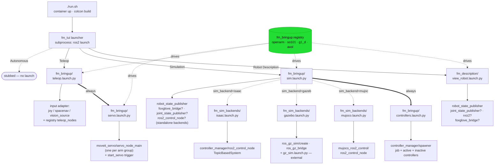
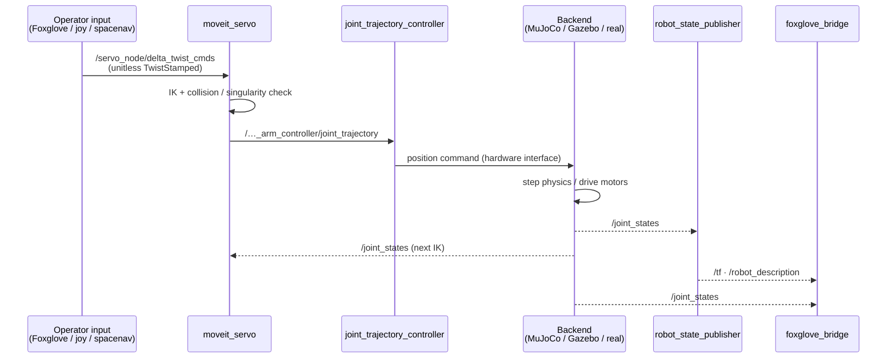

# Architecture

The application layer of First Motive's ROS2 (Humble) stack: the user-facing
entry points that start and drive the whole stack. `fm_tui` is the launcher an
operator drives; `fm_bringup` is the composition root that resolves everything
robot-specific and includes the lower layers.

This repo is the application layer in isolation. For the full-system view — how
bringup sits over the robot, sim, teleop, and data/policy layers — see
[`fm-ros2`](https://github.com/first-motive/fm-ros2). The packages bringup
composes live in sibling repos
([`fm-robot`](https://github.com/first-motive/fm-robot),
[`fm-sim`](https://github.com/first-motive/fm-sim),
[`fm-teleop`](https://github.com/first-motive/fm-teleop)).

## Packages

| Package | Build | Responsibility |
|---------|-------|----------------|
| `fm_bringup` | ament_python | Top-level launch files (sim/servo/teleop), controller configs, teleop input adapters, robot registry resolution |
| `fm_tui` | ament_python | Terminal monitor + menu launcher (Textual) |
| `fm_app` | ament_cmake (meta) | Metapackage tying the two together for a single install |

## Launcher

`fm_tui` walks a registry of action × robot × backend, then shells out the
matching `ros2 launch` via `subprocess`. Three actions are wired; autonomous is a
stub.

Source: [`diagrams/launcher.d2`](diagrams/launcher.d2).

## Bringup Composition

`fm_bringup` composes the robot stack in layers. Description is the foundation;
control sits on it; manual (teleop) and autonomy (auto) layer on control; all
command paths reach the hardware boundary.

The `Hardware Boundary` block is the seam into the robot layer — it expands in
`fm-robot`'s [hardware diagram](https://github.com/first-motive/fm-robot/blob/main/docs/diagrams/hardware.svg).
Source: [`diagrams/bringup.d2`](diagrams/bringup.d2).

## Launch Dependency Graph

Which launch file includes which, what nodes each spawns, what config each loads.
The root is `./run.sh` (in `fm-ros2`), which execs `ros2 run fm_tui
fm_tui_launcher`. The launcher walks action → robot → variant (→ backend), then
shells out `ros2 launch`. `fm_bringup.registry` resolves everything
robot-specific so the launch files stay thin.

Edge meaning: solid bold (`==>`) is an unconditional include; dotted (`-.->`) is
conditional, labelled with the gating argument or predicate; plain (`-->`) is a
node spawn. `gz_sim.launch.py` is the only include that crosses into an external
package; everything else is first-party.

### Include + Spawn Table

| Launch file | Package | Includes | Spawns (— = conditional) |
|-------------|---------|----------|--------------------------|
| `view_robot.launch.py` | fm_description | — | robot_state_publisher; joint_state_publisher—; rviz2—; foxglove_bridge— |
| `sim.launch.py` | fm_bringup | `controllers.launch.py` (always); one `fm_sim_backends/*` by `sim_backend` | robot_state_publisher; foxglove_bridge—; joint_state_publisher—; ros2_control_node— |
| `controllers.launch.py` | fm_bringup | — | controller_manager/spawner; ros2_control_node— (`use_standalone_cm`) |
| `teleop.launch.py` | fm_bringup | `servo.launch.py` (always) | input adapter by `input`; registry `teleop_nodes` |
| `servo.launch.py` | fm_bringup | — | moveit_servo/servo_node_main (per arm) + start_servo trigger |
| `mujoco.launch.py` | fm_sim_backends | — | mujoco_ros2_control/ros2_control_node (`xvfb-run`) |
| `gazebo.launch.py` | fm_sim_backends | `gz_sim.launch.py` (external) | ros_gz_sim/create; ros_gz_bridge/parameter_bridge |
| `isaac.launch.py` | fm_sim_backends | — | controller_manager/ros2_control_node (TopicBasedSystem) |

### Config Files Loaded

| Launch file | Config | Package | Selected by |
|-------------|--------|---------|-------------|
| `sim.launch.py` | `config/<robot>/<variant>/controllers.yaml` | fm_bringup | `spec.controllers_file(variant)` |
| `servo.launch.py` | `config/<robot>/servo.yaml` (per arm) | fm_bringup | `spec.servo_nodes()` |
| `servo.launch.py` | `kinematics.yaml`, `joint_limits.yaml` | external `*_moveit_config` | `spec.moveit_file()` |
| `mujoco` / `isaac` backend | `robot_description` (xacro), `controllers_file` | fm_bringup | passed down from `sim.launch.py` |

`robot_description` is not a YAML file — it is built inline by
`spec.build_description(variant, sim_backend, controllers_file)`, which expands the
xacro, rewrites mesh paths, and injects the backend's `<hardware>` plugin. For the
`mujoco` backend it also injects the robot's MJCF path, looked up from
`fm_sim_models`.

### Standalone Roots

Two launch files run outside the TUI path:

- `fm_bringup/bringup.launch.py` — runtime stack: `foxglove_bridge`,
  `fm_control/control_node`. No includes.
- `fm_sim_core/sim.launch.py` — headless control loop in `fm-sim`. Note this is a
  *different* file from `fm_bringup/sim.launch.py` (the TUI's full sim stack); they
  share a name but neither includes the other.

The direct scripts (`scripts/sim.sh`, `scripts/teleop.sh`,
`scripts/view-robot.sh`) bypass the launcher and call the same `fm_bringup` /
`fm_description` launch files shown above.

## Runtime Data Flow

The core loop is teleop into a simulated or real arm. An operator jog command
becomes a Cartesian/joint delta, MoveIt Servo turns it into a trajectory, the
controller streams it to the active backend, and the backend publishes joint state
back — closing the loop at roughly 100 Hz.

Teleop input is pluggable — `teleop.launch.py input:=foxglove|joy|spacenav` swaps
the adapter, but every adapter normalizes to the same `delta_twist_cmds` topic, so
nothing downstream changes. The adapters and servo wiring live in
[`fm-teleop`](https://github.com/first-motive/fm-teleop).

## Visualization

Visualization is generic across every system (view, sim, teleop, auto). Any ROS
graph topics feed two interchangeable clients: `foxglove_bridge` serves a browser
over a websocket (headless, remote); `rviz2` renders locally (needs an X display).
Launched separately from the system it watches.

Source: [`diagrams/viz.d2`](diagrams/viz.d2).

## Design Notes

| Principle | How it shows up | Payoff |
|-----------|-----------------|--------|
| **Thin launch files** | `fm_bringup.registry` resolves robot/variant/backend | Launch files stay generic; a new robot is a registry entry |
| **Normalize inputs early** | Every teleop adapter emits `delta_twist_cmds` | Add an input device without touching servo or control |
| **Composition root** | `fm_bringup` includes the layers below; they never depend on it | Lower layers stay testable and reusable; no cycles |

Per-package detail lives in each `<package>/README.md`.
